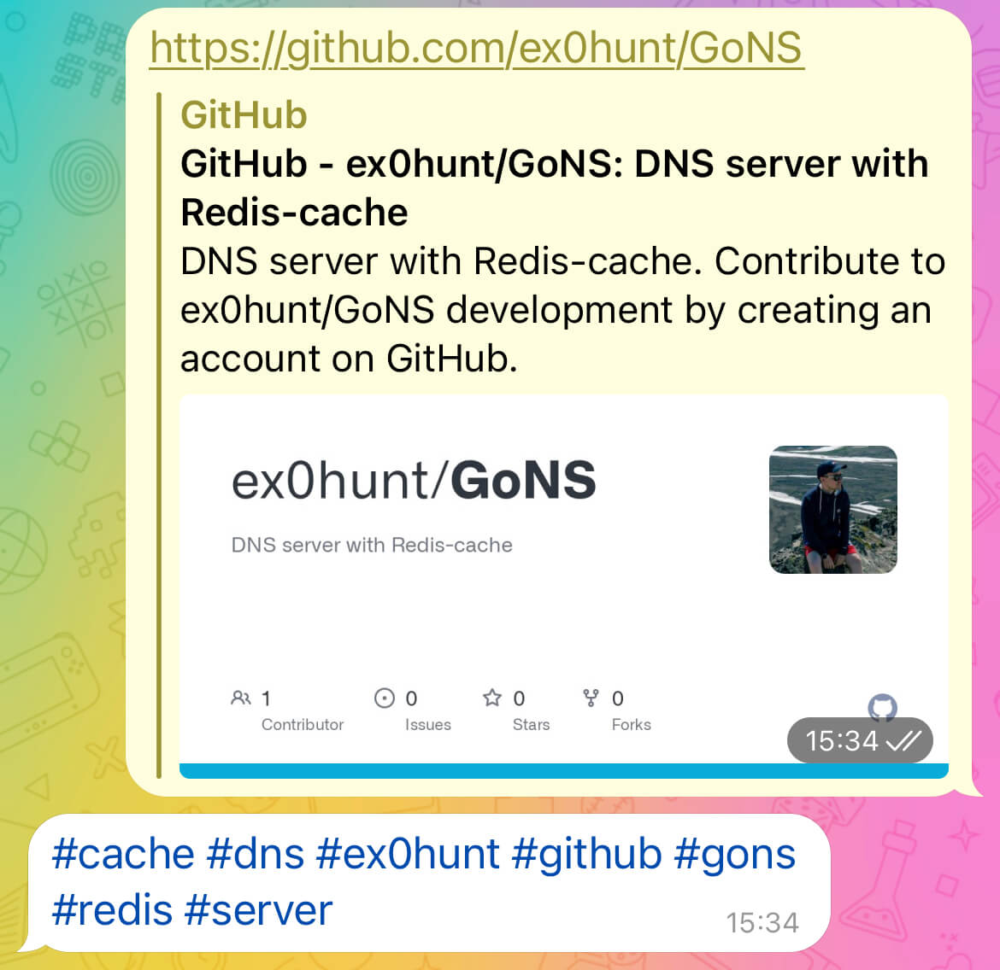

# 🧠 Second brain

Mental assistant which can store and find your memo. Supports russian and english languages.


### What's works now
* Telegram-bot recieves message
* Extract tags from text and links
* Return sorted and uniq tag as anwer by bot

### TODO
* Make web-version (backend & frontend)
* Postgresql as storage for tags and words
* ...

### Usage examples


# About code
Code tested and work on Python 3.9 with [requirements](requirements.txt) in venv. Also yon need to download NLTK packages.

### NLTK Packages
* ```nltk.download('averaged_perceptron_tagger')``` - for english words tokenize
* ```nltk.download('averaged_perceptron_tagger_ru')``` - for russian words tokenize
* ```nltk.download('crubadan')``` - for languade detection
* ```nltk.download('punkt')``` - for word tokenize
* ```nltk.download('omw-1.4')``` - for word lemma (multilang)
* ```nltk.download('wordnet')``` - basic lemma
